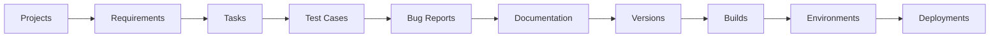
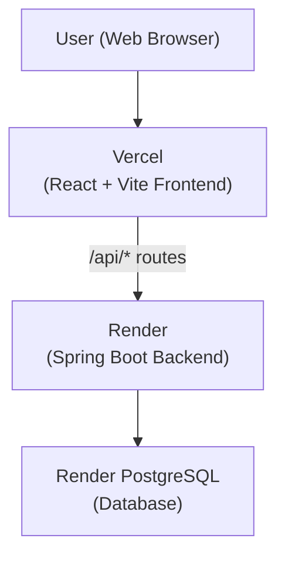

# Enterprise SDLC & DevOps

A full-stack Software Development Lifecycle and DevOps Management Platform designed to manage software development activities from project planning and requirements through tasks, testing, bug tracking, documentation, versioning, builds, environments, and deployment.

The platform brings important SDLC and DevOps activities into a single web application.

---

### 🔗 Live Application

**Frontend:** [Enterprise SDLC & DevOps](https://enterprise-sdlc-devops.vercel.app/)

**Backend API:** [Spring Boot Backend](https://sdlc-manager.onrender.com)

**Backend Health:** [Health Check](https://sdlc-manager.onrender.com/api/health)


## Overview

**Enterprise SDLC & DevOps** centralizes key software development lifecycle activities within a unified interface. Rather than managing requirements, tasks, test cases, bug reports, documentation, releases, and deployments across separate tools, teams manage them together in one integrated workspace governed by role-based access control and project-level data isolation.

The platform features a modern React + TypeScript single-page application built with Vite and Tailwind CSS on the frontend, and a Java 17 Spring Boot 4.1.1 RESTful API backend utilizing Spring Data JPA and Hibernate for PostgreSQL persistence.

---

## SDLC Workflow

The application structured workflow connects key engineering milestones sequentially across the lifecycle:



*Note: User Management is a platform-wide administrative function governing accounts and global roles, operating outside the project-specific lifecycle pipeline shown above.*

---

## Deployment Architecture

The platform operates across cloud infrastructure services as follows:



- **Frontend Hosting:** Deployed on **Vercel** as a single-page application built with React and Vite.
- **Backend Hosting:** Deployed on **Render** as a web service running Java 17 and Spring Boot.
- **Database Hosting:** Hosted as a **PostgreSQL** database on Render.
- **API Communication:** The production frontend communicates with the backend API through `/api` routes, utilizing the existing Vercel rewrite configuration.
- **Browser Isolation:** The web browser communicates exclusively with the frontend and backend API endpoints over HTTP; it does not directly access the PostgreSQL database.

---

## Key Objectives

- **Unified Lifecycle Management:** Single platform covering project planning, development, testing, documentation, releases, and deployment tracking.
- **Traceability & Integration:** Direct linkages connecting requirements to tasks, test cases, and bug reports within each project context.
- **Delivery Visibility:** Track software release versions, build artifacts, target environments, and deployment status alongside ongoing development.
- **Granular Security:** Enforce role-based access controls and project-level data isolation across all endpoints and data models.
- **Cloud Infrastructure:** Fully deployed cloud setup with separate frontend, backend API, and database services.

---

## User Roles & Access Control

Access control combines role-based privileges with project-scoped membership:

| Role | Responsibility & Access Scope |
| :--- | :--- |
| **`ADMIN`** | Platform-level administrator with access to global configurations and user management |
| **`PROJECT_MANAGER`** | Oversees assigned projects, defines requirements, coordinates lifecycle phases, and assigns resources |
| **`DEVELOPER`** | Implements project tasks, manages build items, and updates development deliverables |
| **`TESTER`** | Executes test suites, creates test cases, and files/verifies bug reports within assigned projects |
| **`DEVOPS_ENGINEER`** | Manages environments, release builds, and deployment operations across projects |
| **`CLIENT`** | External stakeholder role with project-scoped visibility into project status |

The exact operations permitted for each role are enforced by the application's access control rules.

---

## Core Modules & Features

| Module / Feature | Description |
| :--- | :--- |
| **User Management** | Administrative control for platform accounts, profiles, and role assignments. |
| **Project Management** | Create, view, and manage software projects, timelines, and status. |
| **Requirements Management** | Capture functional and technical requirements with priority levels, statuses, and project context. |
| **Task Management** | Assign, track, and update development task workflows. |
| **Test Case Management** | Record test cases, execution steps, expected outcomes, and pass/fail results. |
| **Bug Report Management** | Log defects, track resolution lifecycles, and link issues back to test cases and requirements. |
| **Documentation Management** | Central repository for project documentation, guidelines, and technical notes. |
| **Version Management** | Track release milestones, version numbering, and release notes. |
| **Build Management** | Record software build artifacts, commit references, and build statuses. |
| **Environment Management** | Monitor deployment environments (e.g., Development, Staging, Production). |
| **Deployment Management** | Log deployment events, record target environments, and track deployment outcomes. |
| **Role-Based Security** | Six distinct roles governing permissions and access throughout the application. |
| **Project Data Isolation** | Data visibility scoped strictly to projects where a user holds active membership. |

---

## System & Backend Architecture

The backend follows a layered Java/Spring architecture with distinct operational responsibilities:

```
[ HTTP Client / Frontend ]
          │
          ▼
   [ Controller Layer ]      <-- Endpoint mapping, HTTP request parsing, response validation
          │
          ▼
    [ Service Layer ]        <-- Core business logic, access control enforcement
          │
          ▼
   [ Repository Layer ]      <-- Data access via Spring Data JPA interfaces
          │
          ▼
   [ Entity / JPA Layer ]     <-- Object-Relational Mapping (Hibernate)
          │
          ▼
    [ PostgreSQL DB ]        <-- Relational database persistence
```

| Layer | Component Description |
| :--- | :--- |
| **Controller** | Handles HTTP requests under `/api`, parses request payloads, applies validation (`spring-boot-starter-validation`), and returns REST responses. |
| **Service** | Implements business logic, access control enforcement, and transactional logic. |
| **Repository** | Provides data access capabilities through Spring Data JPA interfaces. |
| **Entity** | Maps Java domain objects to PostgreSQL database tables. |
| **JPA / Hibernate** | Object-Relational Mapping (ORM) layer managing domain entity persistence. |

---

## Database Schema & Tables

Data persistence is managed via Spring Data JPA against PostgreSQL. The primary domain entities and their corresponding relational tables include:

| Domain Entity | Relational Table | Description |
| :--- | :--- | :--- |
| **User** | `users` | Platform user credentials, roles, and profiles |
| **Project** | `projects` | Core project metadata, scope, and status |
| **Requirement** | `requirements` | Functional and technical requirements |
| **Task** | `tasks` | Engineering tasks assigned within projects |
| **Test Case** | `test_cases` | Test specifications and execution records |
| **Bug Report** | `bug_reports` | Defect tracking records and verification status |
| **Documentation** | `documentation` | Project knowledge base articles and documentation |
| **Version** | `versions` | Release versions and software milestones |
| **Build** | `builds` | Build artifact records and build metadata |
| **Environment** | `environments` | Hosting environments (Dev, Staging, Prod) |
| **Deployment** | `deployments` | Deployment execution history and target logs |

---

## Technology Stack

### Frontend
- **Framework:** React 19 (TypeScript)
- **Build Tool:** Vite 8
- **Styling:** Tailwind CSS 4
- **Icons & Routing:** Lucide React, React Router 7
- **HTTP Client:** Axios
- **Linter:** Oxlint

### Backend
- **Language:** Java 17
- **Framework:** Spring Boot 4.1.1
- **Web & Validation:** Spring Web MVC, Spring Validation
- **Security:** Spring Security
- **Data Persistence:** Spring Data JPA, Hibernate ORM
- **Database:** PostgreSQL
- **Build Tool:** Maven

### Infrastructure & Deployment
- **Frontend Hosting:** Vercel
- **Backend Hosting:** Render
- **Database Hosting:** Render PostgreSQL
- **Containerization:** Docker, Nginx

---

## Project Directory Structure

```
.
├── Backend/                 # Spring Boot application (Maven project)
│   ├── src/                 # Java source code and resource files
│   ├── pom.xml              # Maven dependencies & configuration
│   ├── Dockerfile           # Docker container setup for Spring Boot backend
│   ├── mvnw                 # Maven wrapper script (Unix)
│   └── mvnw.cmd             # Maven wrapper script (Windows)
├── frontend/                # React + TypeScript SPA (Vite project)
│   ├── src/                 # React components, pages, and API handlers
│   ├── package.json         # Frontend dependencies and scripts
│   ├── vite.config.ts       # Vite configuration & dev proxy settings
│   ├── vercel.json          # Vercel deployment rewrite rules
│   ├── Dockerfile           # Multi-stage Docker configuration with Nginx
│   └── ngnix.config         # Nginx web server configuration
├── docker-compose.yml       # Container orchestration file for local setup
├── LICENSE                  # Open source license file
└── README.md                # Project documentation
```

---

## Local Development Setup

### Prerequisites
- **Git**
- **Node.js** and **npm**
- **JDK 17**
- **PostgreSQL**

### 1. Clone the Repository
```bash
git clone https://github.com/<your-username>/<repository-name>.git
cd <repository-name>
```

### 2. Backend Setup (Port 8080)
1. Configure your local PostgreSQL database connection settings (see [Environment Variables](#environment-variables)).
2. Start the Spring Boot backend server:

```bash
# On Linux / macOS / Git Bash
cd Backend
./mvnw spring-boot:run
```

```powershell
# On Windows PowerShell
cd Backend
.\mvnw.cmd spring-boot:run
```

The backend runs locally at `http://localhost:8080`. Verify system status at `http://localhost:8080/api/health`.

### 3. Frontend Setup (Port 3000)
In a separate terminal:

```bash
cd frontend
npm install
npm run dev
```

The frontend development server runs locally at `http://localhost:3000`.

*Note: The Vite development proxy forwards `/api` requests to the backend on port `8080` during local development. In production, Vercel rewrite rules route `/api` calls directly to the Render backend.*

---

## Environment Variables

Sensitive credentials and environment configuration must be kept in local, untracked files and never committed to version control.

| Component | Required Configuration |
| :--- | :--- |
| **Backend** | PostgreSQL connection properties (`SPRING_DATASOURCE_URL`, `SPRING_DATASOURCE_USERNAME`, `SPRING_DATASOURCE_PASSWORD`, `PORT`) |
| **Frontend** | No additional API variables required for local dev as `/api` routes are handled by Vite proxy / Vercel rewrites |

---

## Docker Support

The application includes containerization support via Docker container specifications and Docker Compose:

```bash
docker-compose up --build
```

- **Frontend Container:** Multi-stage build served via Nginx on port `3000`.
- **Backend Container:** Containerized Spring Boot service running on port `8080`.

---

## Testing & Validation

Application functionality and deployment stability are verified through:
- REST API endpoint verification across backend modules.
- CRUD operation validation across lifecycle modules.
- Integration testing between the React SPA frontend and Spring Boot API backend.
- Health endpoint status checks (`GET /api/health`).
- Deployment verification of live frontend and backend services.

---

## Future Enhancements

Potential future improvements for the platform:
- Automated CI/CD pipeline integration
- Real-time notification and alerting system
- Advanced analytics and reporting dashboards
- System health and performance monitoring
- Cloud-native optimizations and external integrations

---

## Project Notes

**Enterprise SDLC & DevOps** was developed as an academic software engineering project covering a full-stack web application with a layered REST backend, relational database persistence, and cloud deployment architecture.